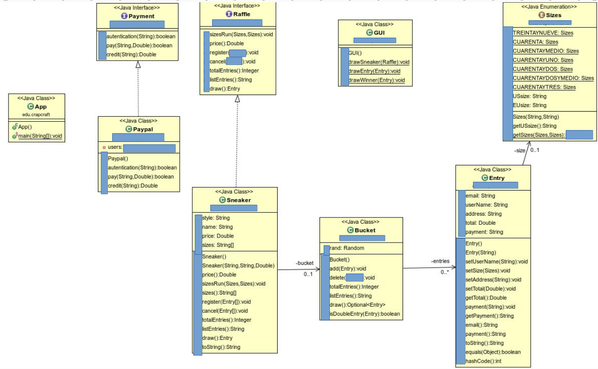

# Sneaker Raffle

>¡¡Esta rama se ha creado para complementar las historias de usuario que no se han podido completar por tiempo en el momento del examen, además, también incluiré refactorizaciones y tomaré decisiones que después de meditarlo considero que pueden hacer más óptimo el programa!! 

# Indice

+   [Introdución](#introdución)
+   [Reglas](#reglas)
    +   [Diagrama de Clases](#diagrama-de-clases)
    +   [Salida CLI](#salida-cli)
+   [Manual](#manual)
    +   [Requisitos previos](#requisitos-previos)
    +   [Instalación](#instalación)
+   [Cambios y errores](#cambios-realizados)
+   [Pruebas](#pruebas)

# Introdución
Este repositorio contiene mi solución al examen de programación orientada a objetos del primero curso de desarrollo de aplicaciones web. En el mismmo trato de implementar todo el conocimiento adquirido y demostrar que tengo la capacidad de trasladar la información del diagrama de clases proporcionado al desarrollo del mismo. Además resaltar que todo el desarrollo se realiza mediante el desarrollo guiado por Test (TDD).

# Reglas

Para cumplir con los requisitos funcionales del software nuestro tutor [@dfleta](https://github.com/dfleta/sneaker-raffle) nos ha proporcionado un documento con las principales funcionalidades del software, un [diagrama de clases](./docs/diagrama_de_clases_UML.png) y el fichero principal [main](./sneakerraffle/src/main/java/edu/craptocraft/App.java).

A continuación cito literalmente el texto que sirve para ponerse en contexto:

>Cuando una tienda de zapatillas recibe una remesa de sneakers de coleccion organiza una rifa entre las personas usuarias registradas para sortear el derecho a comprar la zapatilla.
> Cada participante introduce sus datos personales para el envío del paquete y autoriza un cargo en su sistema de pago preferido para que, si resulta agraciada, la tienda ejecute el cobro pendiente por el precio de la zapatilla.
> Si la participante no resulta elegida, la tienda solicita la anulación del cobro y el sistema de pago elimina el cargo en la cuenta cliente.
> Sólo se permite una participación por persona, por lo que la tienda se  encarga de implementar
una serie de medidas para evitar las dobles entradas (gente que participa dos veces con la misma cuenta) y bots de personas que disponen de más de una cuenta en el sistema.
> Implementa las historias de usuario de las GUI proporcionadas, pero en ASCII.
> La lógica tras cada historia de usuario está descrita en el `main` de la clase principal `App.java`.
>

## Diagrama de clases

## Salida CLI

# Manual

En el siguiente software utilizamos `Maven`, que es una herramienta de software que sirve para construcción de los proyectos java. El beneficio de la compilación de proyecto en esta herramienta es que para la estructuración del mismo se hace por medio de un archivo xml llamado pom.xml que puedes revisar [aquí](./sneakerraffle/pom.xml).

Para probar el programa en su equipo sigua las instrucciones de instalación que a continuación se detallan y asegurase de cumplir los requisitos previos.

# Requisitos previos

| Requisitos | Descripción |
| --- | --- |
| Java | El entorno de ejecución de Java es necesario para ejecutar un archivo .jar. Asegúrate de tener Java instalado en tu equipo. Puedes verificar si Java está instalado ejecutando el comando java -version en la línea de comandos. Si Java no está instalado, puedes descargar la última versión desde el sitio web oficial de Java. |
| Maven | Necesitarás tener Maven instalado en tu equipo para construir y empaquetar el proyecto en un archivo .jar. Puedes verificar si Maven está instalado ejecutando el comando mvn -v en la línea de comandos. Si Maven no está instalado, puedes descargar la última versión desde el sitio web oficial de Maven. |
| Archivo .jar | Asegúrate de tener el archivo .jar generado por Maven. Este archivo se encuentra en el directorio target del proyecto y se nombra con el artefactId y la versión del proyecto. Por ejemplo, si el artefactId es my-app y la versión es 1.0-SNAPSHOT, el archivo se llamará my-app-1.0-SNAPSHOT.jar. |

# Instalación

1. Descarga el proyecto desde el repositorio [aquí](https://github.com/Aminmboankod/Sneaker-raffle/archive/refs/heads/main.zip).
2. Descomprime el archivo ZIP descargado en tu equipo.
3. Abre un terminal o línea de comandos y navega hasta el directorio raíz del proyecto.
4. Ejecuta el comando `mvn clean install` para descargar las dependencias y compilar el proyecto.

5. Si la compilación se realiza con éxito, podrás encontrar el archivo JAR generado en el directorio `target`.

## Uso

1. Abre un terminal o línea de comandos y navega hasta el directorio raíz del proyecto.
2. Ejecuta el comando `java -jar target/sneakerrraffle-1.0-SNAPSCHOT.jar` para iniciar la aplicación.

# Cambios realizados

Teniendo en cuenta que esta rama está realizada después de la realización del examen, se han realizado una serie de cambios importantes para perfeccionar la presentación del mismo.

A continuación se enumeran los cambios realizados por orden de desarrollo:
1. **Crear paquetes:**
    
    He añadido paquetes que dividen las clases para evitar conflictos de nombres, generar más control de acceso a las clases y facilitar la reutiliación de código.

2. **Cambiar la estructra de datos:**

    He cambiado la estructura de datos para almacenar a las rifas, durante el examen, por la especificación de los datos importantes que diferenciaban las distintas rifas usé un HashMap, pero al implementar las siguientes historias de usuario consideré más adecuado usar un HashSet que diferenciaba cada elemento del conjunto.

3. **Reutilizar código:**

    En el método `register(Entry)` de la clase `Sneaker` reutilicé el código completo en el método `register(varargs)` sin pensar en que podía haber implementado directamente el método dentro de la logica del mismo. De modo que lo que hago es reutilizar el método.

4. **Organizo Setters y Getters:**

    Organizo el orden de implementación en la clase de los getters y setters del codigo, elimino los que no se hacen uso y comento el código para que haya más facilidad de lectura.

5. **Cambio los métodos toString():**

    Cambio la configuración de los métodos toString de todas las clases para implementar un StringBuilder que resulta más eficiente en memoria ya que solo usa un espacio sin tener que crear nuevos para cada vez que se concatena un string a otro.

# Pruebas

# Mejoras

Para cumplir completamente con la estructura del diagrama de clases facilitado por nuestro tutor y aplicar totalmente los principios `SOLID` queda pendiente de implementar la clase `Bucket`.